# MLOps PyTorch Pipeline --- CIFAR-10 Image Classification

An end-to-end MLOps pipeline for **CIFAR-10 image classification** using
**PyTorch, MLflow, Docker, FastAPI, and Kubernetes**.

The project takes a CIFAR-10 CNN from training and experiment tracking
through containerization, persistent model storage, Kubernetes
deployment, REST inference, health checks, and CPU-based horizontal
autoscaling.

## 📌 Project Highlights

  Capability            Implementation
  --------------------- --------------------------------------------
  Dataset               CIFAR-10
  Model                 Custom PyTorch CNN
  Training              PyTorch + Adam optimizer
  Experiment Tracking   MLflow
  Configuration         YAML + Kubernetes ConfigMap
  Training Container    Docker
  Serving API           FastAPI + Uvicorn
  Model Storage         Kubernetes PersistentVolumeClaim
  Dataset Storage       Kubernetes PersistentVolumeClaim
  Orchestration         Kubernetes / Minikube
  Service Discovery     Kubernetes ClusterIP Service
  Health Monitoring     Kubernetes readiness/liveness probes
  Autoscaling           Kubernetes HPA
  API Input             Image upload (`multipart/form-data`)
  API Output            Predicted class + class index + confidence

## 🏗️ Architecture

``` mermaid
flowchart TB
    A["CIFAR-10 Dataset"] --> B["Data Loading & Augmentation"]
    C["training_config.yaml"] --> D["Kubernetes ConfigMap"]
    B --> E["PyTorch CNN Training"]
    D --> E
    E --> F["MLflow Experiment Tracking"]
    E --> G["Best Checkpoint<br/>best_model.pt"]
    H["Dockerfile.train"] --> I["Training Image<br/>mlops-cifar10-train:latest"]
    I --> E
    G --> J["Checkpoint PVC<br/>cifar10-checkpoints"]
    K["Dockerfile.serve"] --> L["Serving Image<br/>mlops-cifar10-serve:latest"]
    L --> M["FastAPI Serving Deployment"]
    J --> M
    M --> N["ClusterIP Service<br/>cifar10-service :80 → :8080"]
    N --> O["Client / curl"]
    P["HPA<br/>CPU target 70%<br/>2–4 replicas"] --> M
    Q["Data PVC<br/>cifar10-data"] --> E
```



## 🧠 Machine Learning Pipeline

### Dataset

The project uses CIFAR-10 with 10 classes:

`airplane`, `automobile`, `bird`, `cat`, `deer`, `dog`, `frog`, `horse`,
`ship`, `truck`.

Images are processed as 32 × 32 RGB images. Training augmentation
includes random horizontal flip, random crop with padding, tensor
conversion, and CIFAR-10 normalization.

### CNN Model

The custom CNN contains:

``` text
Input: 3 × 32 × 32
  ↓
Conv2D 3 → 32 → ReLU → MaxPool
  ↓
Conv2D 32 → 64 → ReLU → MaxPool
  ↓
Conv2D 64 → 128 → ReLU → MaxPool
  ↓
Flatten
  ↓
Linear 2048 → 256 → ReLU → Dropout(0.3)
  ↓
Linear 256 → 10
```

## ⚙️ Training Configuration

`configs/training_config.yaml` defines:

  Parameter                         Value
  --------------------- -----------------
  Random seed                          42
  Batch size                           64
  Workers                               2
  Architecture                        CNN
  Classes                              10
  Epochs                               10
  Learning rate                     0.001
  Weight decay                     0.0001
  Early stopping                  Enabled
  Patience                              3
  Minimum improvement               0.001
  Checkpoint              `best_model.pt`

The Kubernetes ConfigMap injects the same configuration into the
training container.

## 📊 Results

### Kubernetes training run

The verified Kubernetes CPU training run achieved:

  Metric                                            Result
  --------------------- ----------------------------------
  Best test accuracy                            **77.47%**
  Best epoch                                         **8**
  Final test accuracy                           **77.43%**
  Device                                               CPU
  Checkpoint              `/app/checkpoints/best_model.pt`

### Recorded evaluation artifact

`artifacts/metrics/evaluation.txt` contains a separate local evaluation
run:

``` text
Device: mps
Test Accuracy: 0.7730
```

The two numbers are from different runs/devices and are intentionally
reported separately.

## 🧪 MLflow Experiment Tracking

Training uses the MLflow experiment:

``` text
cifar10_cnn
```

with run name:

``` text
cnn_training
```

Logged parameters include architecture, epochs, batch size, learning
rate, weight decay, seed, and device.

Logged metrics include train loss, train accuracy, test loss, test
accuracy, and best test accuracy.

The best checkpoint is also logged as an MLflow artifact.

## 🐳 Docker

Two images are used:

``` text
mlops-cifar10-train:latest
mlops-cifar10-serve:latest
```

### Training image

`docker/Dockerfile.train` installs training dependencies, copies `src/`
and `configs/`, and runs:

``` text
python -m src.train
```

### Serving image

`docker/Dockerfile.serve` installs serving dependencies, copies the API
source, runs as a non-root user, exposes port `8080`, and starts
Uvicorn.

## 🌐 FastAPI

The application is defined in:

``` text
src/api/main.py
```

### `GET /`

Returns API information.

``` json
{
  "message": "CIFAR-10 Image Classification API",
  "model": "CNN",
  "device": "cpu"
}
```

### `GET /health`

Used by Kubernetes readiness and liveness probes.

``` json
{
  "status": "ok",
  "model_loaded": true,
  "device": "cpu"
}
```

### `POST /predict`

Accepts an image using multipart form upload:

``` bash
curl -X POST   http://127.0.0.1:8080/predict   -F "file=@test_images/cifar10_test.png"
```

Example response:

``` json
{
  "filename": "cifar10_test.png",
  "prediction": "cat",
  "class_index": 3,
  "confidence": 0.7194,
  "model": "CIFAR10CNN"
}
```

The API validates the upload, converts it to RGB, resizes it to 32 × 32,
normalizes it, performs inference, applies softmax, and returns the
highest-probability class.

## ☸️ Kubernetes

Namespace:

``` text
mlops-cifar10
```

Resources:

``` text
k8s/
├── namespace.yaml
├── configmap.yaml
├── data-pvc.yaml
├── checkpoint-pvc.yaml
├── training-job.yaml
├── serving-deployment.yaml
├── serving-service.yaml
└── hpa.yaml
```

### Persistent storage

Two 1 GiB `ReadWriteOnce` PVCs are used:

-   `cifar10-data` --- CIFAR-10 dataset
-   `cifar10-checkpoints` --- trained model checkpoint

### Training Job

``` text
Job/cifar10-training
```

Image:

``` text
mlops-cifar10-train:latest
```

Resources:

``` text
CPU: 2
Memory: 4Gi
```

It mounts:

``` text
/app/data
/app/checkpoints
/app/configs/training_config.yaml
```

### Serving Deployment

``` text
Deployment/cifar10-serving
```

Initial replicas:

``` text
2
```

Image:

``` text
mlops-cifar10-serve:latest
```

Each pod requests 500m CPU and 1 GiB memory, with limits of 1 CPU and 2
GiB memory.

Readiness and liveness probes both use:

``` text
GET /health
```

The deployment uses a RollingUpdate strategy with `maxSurge: 1` and
`maxUnavailable: 0`.

### Service

``` text
cifar10-service
```

Type:

``` text
ClusterIP
```

Port mapping:

``` text
80 → 8080
```

For local Minikube access:

``` bash
minikube service cifar10-service -n mlops-cifar10 --url
```

Keep the Minikube service tunnel terminal open while using its generated
localhost URL.

## 📈 Horizontal Pod Autoscaling

The HPA is configured as:

  Setting              Value
  ------------------ -------
  Minimum replicas         2
  Maximum replicas         4
  CPU target             70%

Check it with:

``` bash
kubectl get hpa -n mlops-cifar10
```

Monitor CPU with:

``` bash
kubectl top pods -n mlops-cifar10
```

The implementation was verified to scale:

``` text
2 → 4 replicas
```

under sustained CPU load and later:

``` text
4 → 2 replicas
```

after the artificial load was stopped.

## 🚀 Quick Start --- Local

### Prerequisites

-   Python 3.11+
-   Docker
-   Git
-   For Kubernetes: Minikube and kubectl

### Clone

``` bash
git clone https://github.com/Ashum553/mlops-pytorch-pipeline.git
cd mlops-pytorch-pipeline
```

### Train

``` bash
python3 -m venv .venv
source .venv/bin/activate
pip install -r requirements/train.txt
python -m src.train
```

### Evaluate

``` bash
python -m src.evaluate
```

### Serve

``` bash
pip install -r requirements/serve.txt

MODEL_PATH=artifacts/checkpoints/best_model.pt uvicorn src.api.main:app --host 0.0.0.0 --port 8080
```

## ☸️ Quick Start --- Minikube

Start the cluster:

``` bash
minikube start --driver=docker
```

Build the images:

``` bash
docker build -f docker/Dockerfile.train -t mlops-cifar10-train:latest .
docker build -f docker/Dockerfile.serve -t mlops-cifar10-serve:latest .
```

Load them into Minikube:

``` bash
minikube image load mlops-cifar10-train:latest
minikube image load mlops-cifar10-serve:latest
```

Create Kubernetes resources:

``` bash
kubectl apply -f k8s/namespace.yaml
kubectl apply -f k8s/configmap.yaml
kubectl apply -f k8s/data-pvc.yaml
kubectl apply -f k8s/checkpoint-pvc.yaml
```

Populate `cifar10-data` with the CIFAR-10 files, then run:

``` bash
kubectl apply -f k8s/training-job.yaml
kubectl logs -f job/cifar10-training -n mlops-cifar10
```

After training completes:

``` bash
kubectl apply -f k8s/serving-deployment.yaml
kubectl apply -f k8s/serving-service.yaml
kubectl apply -f k8s/hpa.yaml
```

Verify:

``` bash
kubectl get all -n mlops-cifar10
kubectl get pvc -n mlops-cifar10
kubectl get hpa -n mlops-cifar10
```

Get the local service URL:

``` bash
minikube service cifar10-service -n mlops-cifar10 --url
```

Then test:

``` bash
curl http://127.0.0.1:<PORT>/health
```

and:

``` bash
curl -X POST   http://127.0.0.1:<PORT>/predict   -F "file=@test_images/cifar10_test.png"
```

## 🧪 Verification Commands

``` bash
kubectl get pods -n mlops-cifar10
kubectl get deployment -n mlops-cifar10
kubectl get service -n mlops-cifar10
kubectl get pvc -n mlops-cifar10
kubectl get hpa -n mlops-cifar10
kubectl top pods -n mlops-cifar10
kubectl logs -l app=cifar10-serving -n mlops-cifar10
```

## 🔥 HPA Load Test

Generate sustained inference traffic:

``` bash
while true; do
  curl -s -X POST     http://127.0.0.1:<PORT>/predict     -F "file=@test_images/cifar10_test.png"     > /dev/null
done
```

Monitor:

``` bash
kubectl get hpa -n mlops-cifar10
kubectl get pods -n mlops-cifar10
kubectl top pods -n mlops-cifar10
```

Stop the foreground loop with:

``` text
Ctrl+C
```

If background curl processes were used:

``` bash
jobs -l
```

Then terminate the specific processes, or use:

``` bash
pkill curl
```

## 📁 Project Structure

``` text
mlops-pytorch-pipeline/
│
├── artifacts/
│   └── metrics/
│       └── evaluation.txt
│
├── configs/
│   └── training_config.yaml
│
├── docker/
│   ├── Dockerfile.train
│   └── Dockerfile.serve
│
├── k8s/
│   ├── namespace.yaml
│   ├── configmap.yaml
│   ├── data-pvc.yaml
│   ├── checkpoint-pvc.yaml
│   ├── training-job.yaml
│   ├── serving-deployment.yaml
│   ├── serving-service.yaml
│   └── hpa.yaml
│
├── requirements/
│   ├── train.txt
│   └── serve.txt
│
├── src/
│   ├── api/
│   │   ├── __init__.py
│   │   └── main.py
│   ├── dataset.py
│   ├── model.py
│   ├── train.py
│   └── evaluate.py
│
├── .gitignore
└── README.md
```

## 🧩 Kubernetes Resource Summary

  Resource     Name                    Purpose
  ------------ ----------------------- ------------------------
  Namespace    `mlops-cifar10`         Project isolation
  ConfigMap    `training-config`       Training configuration
  PVC          `cifar10-data`          Dataset storage
  PVC          `cifar10-checkpoints`   Model storage
  Job          `cifar10-training`      Model training
  Deployment   `cifar10-serving`       Inference API
  Service      `cifar10-service`       API routing
  HPA          `cifar10-serving-hpa`   CPU autoscaling

## 🔐 Resource Management

### Training

``` text
Requests: 2 CPU, 4Gi memory
Limits:   2 CPU, 4Gi memory
```

### Serving

``` text
Requests: 500m CPU, 1Gi memory
Limits:   1 CPU, 2Gi memory
```

These CPU requests are also relevant to the HPA's CPU utilization
calculation.

## 🔄 Git Workflow

Development used feature branches and pull requests.

The Kubernetes implementation was developed on:

``` text
feature/k8s-training
```

and merged into:

``` text
main
```

through Pull Request #3.

The feature branch was subsequently deleted after the merge.

## ✅ Verified Capabilities

-   [x] CIFAR-10 CNN training
-   [x] Config-driven training
-   [x] MLflow experiment tracking
-   [x] Best-model checkpointing
-   [x] Docker training image
-   [x] Docker serving image
-   [x] Kubernetes namespace
-   [x] Dataset PVC
-   [x] Checkpoint PVC
-   [x] Kubernetes training Job
-   [x] FastAPI serving Deployment
-   [x] ClusterIP Service
-   [x] `/health` endpoint
-   [x] `/predict` endpoint
-   [x] Model loading from checkpoint PVC
-   [x] CPU/memory requests and limits
-   [x] Readiness/liveness probes
-   [x] HPA scale-up: 2 → 4 replicas
-   [x] HPA scale-down: 4 → 2 replicas
-   [x] RollingUpdate deployment strategy

## ⚠️ Current Scope

This is a **local MLOps/Kubernetes demonstration** using Minikube.

The current repository does not include:

-   Cloud deployment
-   GPU training
-   Kubernetes Ingress
-   External load balancer
-   Automated CI/CD workflow
-   Production secrets management
-   Model registry promotion workflow
-   A dedicated MLflow tracking server deployed inside Kubernetes
-   A production observability stack

These would be natural next steps for a production deployment.

## 🛠️ Technology Stack

-   **Python** --- application and ML development
-   **PyTorch** --- CNN training and inference
-   **Torchvision** --- CIFAR-10 dataset and transforms
-   **NumPy** --- numerical operations
-   **PyYAML** --- configuration
-   **MLflow** --- experiment and artifact tracking
-   **FastAPI** --- inference API
-   **Uvicorn** --- ASGI server
-   **Pillow** --- image processing
-   **Docker** --- containerization
-   **Kubernetes** --- orchestration
-   **Minikube** --- local Kubernetes cluster
-   **kubectl** --- Kubernetes management
-   **Git/GitHub** --- version control

## 📚 End-to-End Summary

``` text
CIFAR-10 Dataset
       ↓
Data Loading + Augmentation
       ↓
PyTorch CNN Training
       ↓
MLflow Experiment Tracking
       ↓
Best Model Checkpoint
       ↓
Kubernetes Checkpoint PVC
       ↓
FastAPI Serving Container
       ↓
Kubernetes Deployment
       ↓
ClusterIP Service
       ↓
Image Classification API
       ↓
HPA: 2 ↔ 4 replicas
```

This project demonstrates the complete path from a PyTorch
image-classification model to a containerized, persistent,
health-checked, and horizontally scalable Kubernetes inference service.
